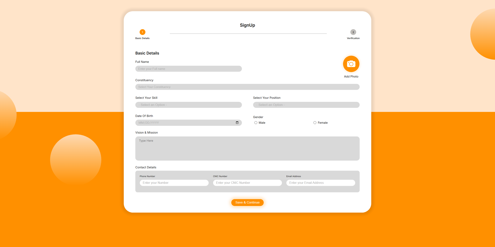
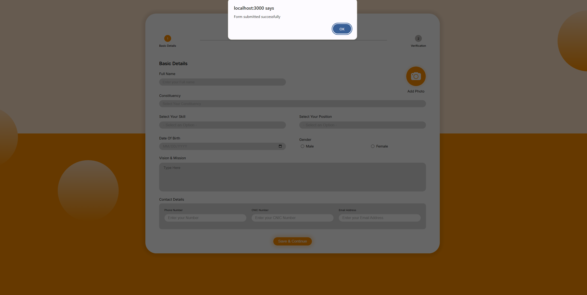
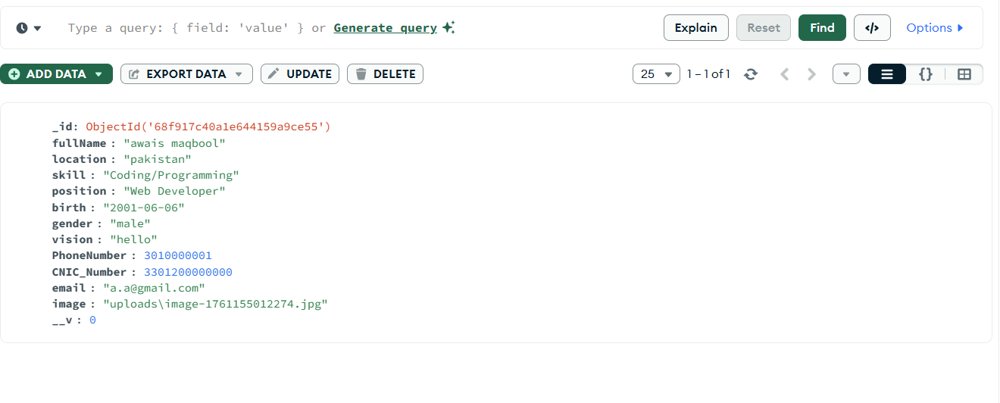

<hr>
</div>

<div align="center">
<h2> Project Name : Form Submission App </h2>




</div>

## 💡 Overview
A full-stack form submission project built with **HTML, CSS, Node.js, Express, and MongoDB**.  
It allows users to submit form data, validates the input, and stores it securely in a MongoDB database.

## 🚀 Features

- User-friendly frontend with HTML and CSS  
- Backend built on Express.js and Node.js  
- MongoDB for storing submissions  
- Data validation and error handling  
- Environment-based configuration using dotenv  
- File uploads handled with Multer  
## 👩‍💻 Tech Stack

- **HTML & CSS**: Standard languages for creating and styling web pages to ensure a clean and responsive user interface.
- **Node.js**: A JavaScript runtime built on Chrome's V8 engine for building fast and scalable server-side applications.
- **Express.js**: A minimal and flexible web application framework for Node.js that provides a robust set of features for web and mobile applications.
- **MongoDB**: A NoSQL database that provides a high-performance, scalable, and document-oriented data storage solution.
- **Multer**: A Node.js middleware for handling multipart/form-data, primarily used for uploading files.
## 📦 Getting Started

To get a local copy of this project up and running, follow these steps.

### 🚀 Prerequisites

- **Node.js** (v24.13.0 or higher) and **npm**.
- **Npm** If you prefer using npm for package management and running scripts.
- **MongoDB** (or another supported NonSQL database).

## 🛠️ Installation

1. **Clone the repository:**

   ```bash
   git clone https://github.com/dev-awais-maqbool/Form-Submission-App.git
   cd readme-template
   ```

2. **Install dependencies:**

   Using Npm:

   ```bash
   npm install
   ```

3. **Set up environment variables:**

   Create a `.env` file in the root directory and add the following variables:

   ```env
   MONGO_URI=your_database_url
   PORT=your_port
   ```
4. **Start the development server:**

   ```start
   node server.js
   ```
   ---
   ---
   ---
